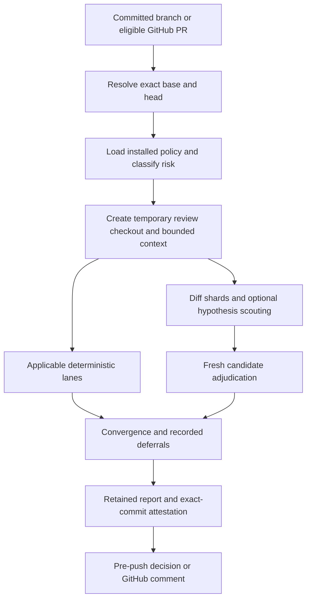

# How Rove Sentinel works

Sentinel is a local Node.js orchestrator. Claude Code and Codex provide the
reviewer processes; Sentinel prepares context, validates structured output,
applies policy, and owns the final record. It does not embed an LLM or copy
provider code into the package.

## The review unit

Identity includes normalized repository, merge base, head SHA, engine version,
charter version, and installed policy digest. A result for an earlier commit,
different base, different policy, or different repository cannot substitute for
the requested review. The reviewed code is a detached Git worktree. Working-tree
edits are not silently included.

The context contains a bounded textual diff, file manifest, risk reasons,
installed charter and relevant lessons, commit history, reference map, and
matching open bug briefs when that project convention exists. It is not a
persistent semantic index. Reference discovery is heuristic and strongest for
the languages covered by its parsers. Excluded files remain visible in the
manifest; excluded binary contents are not reviewed as text.

## Review and verification stages

Low-risk work uses bounded shards. Medium and high risk add a scout and focused
hypothesis reviews. Shards cover the included hunks; they do not guarantee that
a model understood or detected every defect. Candidate findings are independently
adjudicated in fresh contexts and validated against a structured schema.

Author-family routing normally puts the other provider in the lead. Human
changes use risk-based routing. The inherited `grok/` author label routes to
Claude only; there is no Grok provider. Both installed providers remain required
for the supported configuration.

Markdownlint runs in a bounded subprocess against changed Markdown. Optional
Clippy runs only when installed policy enables it. Tool unavailability and
timeouts are reported as lane notes; a partial deterministic run is not a clean
bill of health. A process tree that cannot be proven terminated fails closed.

## Repairs and decisions

Compatible reviewed ancestors permit incremental follow-up. Previous blockers
are rechecked. New verified P0/P1 always block. P2 enforcement distinguishes
the latest repair, persistent blockers, and late discoveries outside the repair.
The current limits are six repair rounds and two late-discovery blocking rounds.
Budget exhaustion never silently erases a finding: eligible advisories require
an explicit recorded deferral before the hook accepts them. Deferrals are tied
to finding identity and lineage; P0/P1 are not deferrable.

## Operations and bounds

One watcher serializes reviews for a repository, while a review can use up to
eight provider subprocesses. Medium/high shard maxima are four/eight. The text
patch limit is 4 MiB; the hook wait bound is 120 minutes. An ordinary push may
carry at most sixteen candidate refs and at most one that still needs review.
The default retention is thirty days, capped at eighty attestations and fifty
reports; audit events have separate bounds. See `constants.mjs` for all limits.

State identity is shared by local clones of the same remote. To preserve the
Rove migration and prevent duplicate watchers, this release retains the legacy
`Rove/shared-review-gate` Windows state namespace and `Rove-Shared-Review-Gate`
task prefix. Engine and policy version checks prevent stale evidence reuse.
On macOS and Linux corresponding inherited state paths remain implemented but
are not evidence of live platform qualification.

## Module map for contributors

| Modules | Responsibility |
| --- | --- |
| `cli`, `init`, `config`, `install` | Entry points, onboarding and trusted installation |
| `gate`, `risk`, `shards`, `convergence`, `dispositions` | Review planning and final decisions |
| `context`, `refmap`, `git` | Committed inputs, isolated checkout and bounded context |
| `providers`, `process`, `detach`, `cleanup` | CLI adapters and subprocess lifecycle |
| `lint`, `guiEvidence`, `evidenceSlug` | Deterministic and optional visual-evidence checks |
| `daemon`, `prepush`, `github` | Queue, push enforcement and eligible PR comments |
| `storage`, `ledger`, `constants` | Records, external-review comparison and protocol limits |

Code lives under `scripts/review-gate/` to preserve extraction history and
regression coverage. This directory name is internal; users invoke
`rove-sentinel`.
